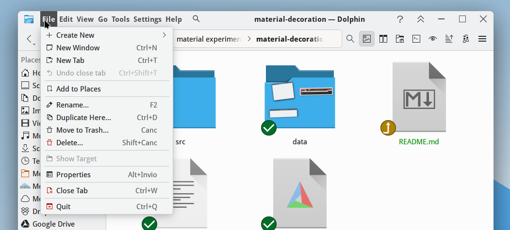

# material-decoration

Material-ish window decoration theme for KWin

### Locally Integrated Menu & Search

This hides the AppMenu icon button and draws the menu in the titlebar. It also
includes a search button to find actions. It works on both X11 and Wayland. On
Wayland, GTK apps don't export the menu. You need to start them with 
`GDK_BACKEND=x11` environment variable.

### Configuration

Make sure you add the AppMenu button in System Settings > Colors & Themes >
Window Decorations > Configure Titlebar Buttons…. 

There, by clicking the pencil icon that is displayed when you select
the Material theme, you can modify various aspects of the decoration,
both in terms of appearance and behaviour. For example, you can transform
it into a hamburger menu, disable the search function, and even decide whether
to include inactive actions (those that are greyed out) in the search results.

### Actions on Press-and-Hold buttons

Pressing and holding the “Close” button will minimize the window to the traybar if the [kwin-minimize2tray](https://aur.archlinux.org/packages/kwin-minimize2tray-git) script is present and enabled.

On Plasma 6.6, pressing and holding the "Minimize" button will minimize ALL windows but the active one on Plasma 6.6 (Wayland). This requires MinimizeAll script (please enable it in System Settings).
For X11, please copy the directory `/usr/share/kwin-wayland/scripts/minimizeall` to `/usr/share/kwin-x11/scripts/minimizeall`

# Build instructions for Plasma 6

```
git clone https://github.com/guiodic/material-decoration.git
cd material-decoration
mkdir build
cd build
cmake .. -DQT_MAJOR_VERSION=6 -DQT_VERSION_MAJOR=6
make
sudo make install
```
for Arch and derivatives, please install the AUR package 
[material-kwin-decoration-git](https://aur.archlinux.org/packages/material-kwin-decoration-git)


NOTE: the master branch is aligned with the latest Plasma version. For earlier
ones, see the other branches.

....

TODO/Bugs ([Issue #1](https://github.com/Zren/material-decoration/issues/1)):

* Open Submenu on Shortcut (eg: `Alt+F`)
* Display mnemonics when holding `Alt`
